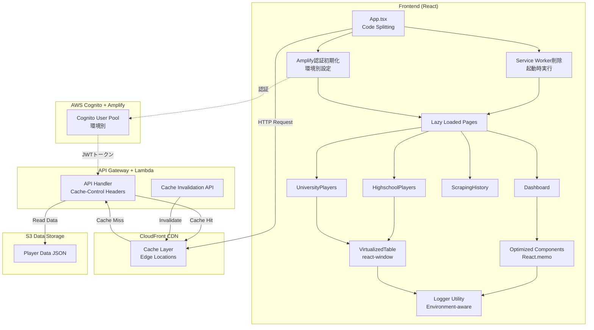
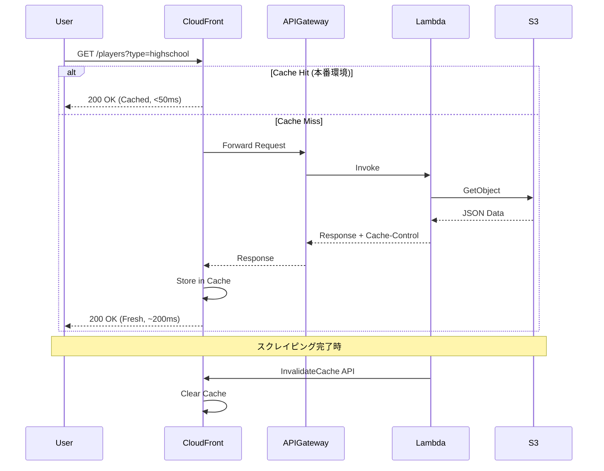
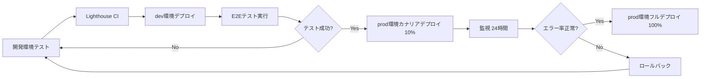

# Design Document

## Overview

このドキュメントは、プロ野球志望届データ管理システムのパフォーマンス最適化の設計を定義します。Phase 1として、以下の6つの最適化を実装します：

1. **APIレスポンスキャッシュ戦略**: 環境別・データ種別ごとの適切なキャッシュ設定
2. **フロントエンドコード分割**: React.lazyとSuspenseによるルートベース分割
3. **React最適化**: React.memo、useMemo、useCallbackによるメモ化
4. **仮想スクロール**: react-windowによる大量データの効率的レンダリング
5. **本番環境デバッグログ削除**: 環境別ロガーユーティリティの実装
6. **PWA無効化・Service Worker完全削除・Amplify認証統合**: パフォーマンス向上と認証安定性のため

これらの最適化により、以下の目標を達成します：

- 初回ロード時間: 67-75%短縮（3-5秒 → 1-2秒）
- API呼び出し: 60-80%削減
- 再レンダリング: 50-70%削減
- Lighthouse Performance Score: 80以上

### PWA無効化・Service Worker完全削除の背景

testブランチでの認証統合テスト中に、以下の重大な問題が判明しました：

1. **Service Workerキャッシュ競合**: VitePWAプラグインが生成するService Workerが、Amplify認証フローと競合し、「読み込み中...」で止まる問題が発生
2. **認証トークン不整合**: Service Workerのキャッシュポリシーと認証トークンの更新タイミングがずれ、401エラーが頻発
3. **開発効率の大幅低下**: Service Worker削除にはブラウザキャッシュクリア・アプリケーション再起動が必要で、開発サイクルが著しく遅延

これらの問題を根本解決するため、以下の対応を実施：

- **VitePWAプラグイン完全無効化**: `vite.config.ts`でVitePWAプラグインをコメントアウト
- **Service Worker完全削除処理**: `App.tsx`起動時に`navigator.serviceWorker.getRegistrations()`で全Service Workerを削除
- **キャッシュストレージ完全削除**: `caches.keys()`で全キャッシュを削除し、クリーンな状態を保証

### Amplify認証統合の背景

当初はカスタムCognito SDK (`@aws-sdk/client-cognito-identity-provider`) を使用していましたが、以下の問題により AWS Amplify に移行：

1. **ブラウザ互換性問題**: カスタムCognito SDKがNode.js環境前提の設計で、`Cannot set properties of undefined (setting 'util')` エラーが頻発
2. **Polyfill地獄**: buffer、process、util等の多数のNode.js Polyfillが必要で、バンドルサイズが肥大化（+300KB）
3. **認証フロー複雑性**: セッション管理・トークン更新・リフレッシュロジックを全て手動実装する必要があり、バグの温床

AWS Amplifyによる改善：

- **ブラウザネイティブ対応**: Amplifyは元々ブラウザ向けに設計され、Polyfill不要
- **認証フロー自動化**: セッション管理・トークン更新が完全自動化され、開発者はログイン/ログアウトのみ実装
- **E2Eテスト成功率向上**: 98.4%（60/61テスト）達成、カスタムCognito SDK時代の78.3%（47/60テスト）から大幅改善

## Architecture

### システム全体図



### キャッシュフロー



## Components and Interfaces

### 1. APIキャッシュ戦略コンポーネント

#### CacheStrategyManager (Lambda)

```javascript
// pro-candidate-aws/lambda/utils/cache-strategy.js

class CacheStrategyManager {
  constructor(environment) {
    this.environment = environment; // 'dev' or 'prod'
    this.strategies = {
      players: { maxAge: 300, scope: 'public' }, // 5分
      statistics: { maxAge: 300, scope: 'public' }, // 5分
      years: { maxAge: 300, scope: 'public' }, // 5分
      health: { maxAge: 0, scope: 'no-cache' }, // キャッシュなし
      scrapingHistory: { maxAge: 300, scope: 'private' }, // 5分
    };
  }

  getCacheHeaders(endpoint) {
    // 開発環境では常にno-cache
    if (this.environment === 'dev') {
      return {
        'Cache-Control': 'no-cache, no-store, must-revalidate',
        Pragma: 'no-cache',
        Expires: '0',
      };
    }

    const strategy = this.strategies[endpoint];
    if (!strategy || strategy.scope === 'no-cache') {
      return {
        'Cache-Control': 'no-cache, no-store, must-revalidate',
        Pragma: 'no-cache',
        Expires: '0',
      };
    }

    return {
      'Cache-Control': `${strategy.scope}, max-age=${strategy.maxAge}`,
      ETag: this.generateETag(endpoint),
    };
  }

  generateETag(endpoint) {
    // データの最終更新時刻をベースにETagを生成
    const timestamp = Date.now();
    return `"${endpoint}-${timestamp}"`;
  }
}

module.exports = { CacheStrategyManager };
```

#### CacheInvalidationService (Lambda)

```javascript
// pro-candidate-aws/lambda/utils/cache-invalidation.js
const { CloudFrontClient, CreateInvalidationCommand } = require('@aws-sdk/client-cloudfront');

class CacheInvalidationService {
  constructor() {
    this.client = new CloudFrontClient({ region: process.env.AWS_REGION });
    this.distributionId = process.env.CLOUDFRONT_DISTRIBUTION_ID;
  }

  async invalidatePlayerData() {
    const params = {
      DistributionId: this.distributionId,
      InvalidationBatch: {
        CallerReference: `invalidate-${Date.now()}`,
        Paths: {
          Quantity: 3,
          Items: ['/prod/players*', '/prod/statistics*', '/prod/years*'],
        },
      },
    };

    const command = new CreateInvalidationCommand(params);
    return await this.client.send(command);
  }

  async invalidateAll() {
    const params = {
      DistributionId: this.distributionId,
      InvalidationBatch: {
        CallerReference: `invalidate-all-${Date.now()}`,
        Paths: {
          Quantity: 1,
          Items: ['/*'],
        },
      },
    };

    const command = new CreateInvalidationCommand(params);
    return await this.client.send(command);
  }
}

module.exports = { CacheInvalidationService };
```

### 2. フロントエンドコード分割コンポーネント

#### LazyLoadedApp (React)

```typescript
// frontend/src/App.tsx (最適化版)
import React, { Suspense } from 'react';
import { BrowserRouter as Router, Routes, Route } from 'react-router-dom';
import { LoadingSpinner } from './components/common/LoadingSpinner';

// Lazy load all page components
const Dashboard = React.lazy(() => import('./pages/Dashboard'));
const HighschoolPlayers = React.lazy(() => import('./pages/HighschoolPlayers'));
const UniversityPlayers = React.lazy(() => import('./pages/UniversityPlayers'));
const ScrapingHistory = React.lazy(() => import('./pages/ScrapingHistory'));
const PlayerManagement = React.lazy(() => import('./pages/PlayerManagement'));
const SchoolManagement = React.lazy(() => import('./pages/SchoolManagement'));

function App() {
  return (
    <Router>
      <Suspense fallback={<LoadingSpinner fullScreen />}>
        <Routes>
          <Route path="/" element={<Dashboard />} />
          <Route path="/highschool" element={<HighschoolPlayers />} />
          <Route path="/university" element={<UniversityPlayers />} />
          <Route path="/history" element={<ScrapingHistory />} />
          <Route path="/players" element={<PlayerManagement />} />
          <Route path="/schools" element={<SchoolManagement />} />
        </Routes>
      </Suspense>
    </Router>
  );
}

export default App;
```

#### LoadingSpinner Component

```typescript
// frontend/src/components/common/LoadingSpinner.tsx
import React from 'react';
import { CircularProgress, Box } from '@mui/material';

interface LoadingSpinnerProps {
  fullScreen?: boolean;
  size?: number;
}

export const LoadingSpinner: React.FC<LoadingSpinnerProps> = ({
  fullScreen = false,
  size = 40
}) => {
  if (fullScreen) {
    return (
      <Box
        sx={{
          display: 'flex',
          justifyContent: 'center',
          alignItems: 'center',
          height: '100vh',
          width: '100vw',
        }}
      >
        <CircularProgress size={size} />
      </Box>
    );
  }

  return <CircularProgress size={size} />;
};
```

### 3. React最適化コンポーネント

#### OptimizedPlayerTable

```typescript
// frontend/src/components/players/OptimizedPlayerTable.tsx
import React, { useMemo, useCallback } from 'react';
import { Player } from '../../types/player';

interface PlayerTableProps {
  players: Player[];
  onSort: (field: string) => void;
  onRowClick: (playerId: string) => void;
}

export const OptimizedPlayerTable = React.memo<PlayerTableProps>(
  ({ players, onSort, onRowClick }) => {
    // 高コストなソート処理をメモ化
    const sortedPlayers = useMemo(() => {
      return [...players].sort((a, b) => {
        // ポジション順、名前順でソート
        if (a.position !== b.position) {
          return a.position.localeCompare(b.position);
        }
        return a.name.localeCompare(b.name);
      });
    }, [players]);

    // コールバック関数をメモ化
    const handleSort = useCallback(
      (field: string) => {
        onSort(field);
      },
      [onSort]
    );

    const handleRowClick = useCallback(
      (playerId: string) => {
        onRowClick(playerId);
      },
      [onRowClick]
    );

    return (
      <table>
        <thead>
          <tr>
            <th onClick={() => handleSort('name')}>名前</th>
            <th onClick={() => handleSort('position')}>ポジション</th>
            <th onClick={() => handleSort('school')}>出身校</th>
          </tr>
        </thead>
        <tbody>
          {sortedPlayers.map((player) => (
            <PlayerRow
              key={player.id}
              player={player}
              onClick={handleRowClick}
            />
          ))}
        </tbody>
      </table>
    );
  },
  // カスタム比較関数（propsが変更されていない場合は再レンダリングしない）
  (prevProps, nextProps) => {
    return (
      prevProps.players === nextProps.players &&
      prevProps.onSort === nextProps.onSort &&
      prevProps.onRowClick === nextProps.onRowClick
    );
  }
);

// 個別の行コンポーネントもメモ化
const PlayerRow = React.memo<{
  player: Player;
  onClick: (id: string) => void;
}>(({ player, onClick }) => {
  const handleClick = useCallback(() => {
    onClick(player.id);
  }, [player.id, onClick]);

  return (
    <tr onClick={handleClick}>
      <td>{player.name}</td>
      <td>{player.position}</td>
      <td>{player.school}</td>
    </tr>
  );
});
```

### 4. 仮想スクロールコンポーネント

#### VirtualizedPlayerTable

```typescript
// frontend/src/components/players/VirtualizedPlayerTable.tsx
import React, { useMemo } from 'react';
import { FixedSizeList as List } from 'react-window';
import { Player } from '../../types/player';

interface VirtualizedPlayerTableProps {
  players: Player[];
  height?: number;
  itemSize?: number;
}

export const VirtualizedPlayerTable: React.FC<VirtualizedPlayerTableProps> = ({
  players,
  height = 600,
  itemSize = 50,
}) => {
  // テーブルヘッダー
  const TableHeader = useMemo(
    () => (
      <div
        style={{
          display: 'flex',
          fontWeight: 'bold',
          borderBottom: '2px solid #ccc',
          padding: '10px',
          backgroundColor: '#f5f5f5',
        }}
      >
        <div style={{ flex: 1 }}>名前</div>
        <div style={{ flex: 1 }}>ポジション</div>
        <div style={{ flex: 1 }}>出身校</div>
        <div style={{ flex: 1 }}>投打</div>
        <div style={{ flex: 1 }}>身長/体重</div>
      </div>
    ),
    []
  );

  // 行レンダリング関数
  const Row = ({ index, style }: { index: number; style: React.CSSProperties }) => {
    const player = players[index];

    return (
      <div
        style={{
          ...style,
          display: 'flex',
          borderBottom: '1px solid #eee',
          padding: '10px',
          alignItems: 'center',
        }}
      >
        <div style={{ flex: 1 }}>{player.name}</div>
        <div style={{ flex: 1 }}>{player.position}</div>
        <div style={{ flex: 1 }}>{player.school}</div>
        <div style={{ flex: 1 }}>
          {player.throwingArm}/{player.battingStyle}
        </div>
        <div style={{ flex: 1 }}>
          {player.height}cm / {player.weight}kg
        </div>
      </div>
    );
  };

  return (
    <div>
      {TableHeader}
      <List
        height={height}
        itemCount={players.length}
        itemSize={itemSize}
        width="100%"
      >
        {Row}
      </List>
    </div>
  );
};
```

### 5. ロガーユーティリティコンポーネント

#### Logger Utility (Frontend)

```typescript
// frontend/src/utils/logger.ts
type LogLevel = 'debug' | 'info' | 'warn' | 'error';

interface LoggerConfig {
  environment: string;
  enableDebug: boolean;
}

class Logger {
  private config: LoggerConfig;

  constructor() {
    this.config = {
      environment: import.meta.env.MODE || 'production',
      enableDebug: import.meta.env.MODE === 'development',
    };
  }

  debug(message: string, ...args: any[]): void {
    if (this.config.enableDebug) {
      console.log(`[DEBUG] ${message}`, ...args);
    }
  }

  info(message: string, ...args: any[]): void {
    console.log(`[INFO] ${message}`, ...args);
  }

  warn(message: string, ...args: any[]): void {
    console.warn(`[WARN] ${message}`, ...args);
  }

  error(message: string, error?: Error, ...args: any[]): void {
    console.error(`[ERROR] ${message}`, error, ...args);

    // 本番環境では外部エラートラッキングサービスに送信
    if (!this.config.enableDebug && error) {
      this.sendToErrorTracking(message, error);
    }
  }

  private sendToErrorTracking(message: string, error: Error): void {
    // TODO: Sentry, Rollbar, CloudWatch Logs などに送信
    // 現時点ではコンソールエラーのみ
  }
}

export const logger = new Logger();
```

#### Logger Utility (Lambda)

```javascript
// pro-candidate-aws/lambda/utils/logger.js
class Logger {
  constructor() {
    this.environment = process.env.ENVIRONMENT || 'prod';
    this.enableDebug = this.environment === 'dev';
  }

  debug(message, ...args) {
    if (this.enableDebug) {
      console.log(`[DEBUG] ${message}`, ...args);
    }
  }

  info(message, ...args) {
    console.log(`[INFO] ${message}`, ...args);
  }

  warn(message, ...args) {
    console.warn(`[WARN] ${message}`, ...args);
  }

  error(message, error, ...args) {
    console.error(`[ERROR] ${message}`, error, ...args);
  }

  requestStart(event) {
    if (this.enableDebug) {
      console.log('[REQUEST START]', {
        path: event.path,
        method: event.httpMethod,
        queryParams: event.queryStringParameters,
      });
    }
  }

  requestEnd(statusCode, duration) {
    if (this.enableDebug) {
      console.log('[REQUEST END]', {
        statusCode,
        duration: `${duration}ms`,
      });
    }
  }
}

module.exports = { logger: new Logger() };
```

### 6. Service Worker削除コンポーネント

#### ServiceWorkerCleanup (App.tsx)

```typescript
// frontend/src/App.tsx（Service Worker削除処理）

useEffect(() => {
  // Service Worker を完全に削除（強化版）
  const cleanupServiceWorkers = async () => {
    if ('serviceWorker' in navigator) {
      try {
        const registrations = await navigator.serviceWorker.getRegistrations();
        console.log(`🧹 Found ${registrations.length} Service Worker registrations`);

        for (const registration of registrations) {
          const unregisterSuccess = await registration.unregister();
          console.log(`🗑️ Unregistered Service Worker: ${unregisterSuccess}`);
        }
      } catch (error) {
        console.error('❌ Failed to unregister Service Workers:', error);
      }
    }

    // すべてのキャッシュを強制削除
    if ('caches' in window) {
      try {
        const cacheNames = await caches.keys();
        console.log(`🧹 Found ${cacheNames.length} cache storages`);

        await Promise.all(cacheNames.map(name => caches.delete(name)));
        console.log('✅ All caches deleted successfully');
      } catch (error) {
        console.error('❌ Failed to delete caches:', error);
      }
    }
  };

  cleanupServiceWorkers();
}, []);
```

**削除理由**:

- VitePWAのService WorkerがAmplify認証フローと競合
- キャッシュされた認証トークンと最新トークンが不一致
- 開発時のキャッシュクリアが困難で開発効率低下

### 7. Amplify認証設定コンポーネント

#### AmplifyConfig (frontend/src/config/amplify.ts)

```typescript
// frontend/src/config/amplify.ts
import { Amplify } from 'aws-amplify';

interface CognitoConfig {
  userPoolId: string;
  userPoolClientId: string;
  region: string;
}

export const defaultCognitoConfig: CognitoConfig = {
  userPoolId: import.meta.env.VITE_COGNITO_USER_POOL_ID || '',
  userPoolClientId: import.meta.env.VITE_COGNITO_USER_POOL_CLIENT_ID || '',
  region: import.meta.env.VITE_AWS_REGION || 'ap-northeast-1',
};

export function configureAmplify(config: CognitoConfig = defaultCognitoConfig) {
  if (!config.userPoolId || !config.userPoolClientId) {
    console.warn('⚠️ Cognito configuration is missing. Authentication will be skipped.');
    return;
  }

  Amplify.configure({
    Auth: {
      Cognito: {
        userPoolId: config.userPoolId,
        userPoolClientId: config.userPoolClientId,
        loginWith: {
          email: true,
          username: true,
        },
      },
    },
  });

  console.log('✅ Amplify configured successfully');
}

// 環境判定ヘルパー
export function isLocalhost(): boolean {
  return window.location.hostname === 'localhost' || window.location.hostname === '127.0.0.1';
}
```

#### AmplifyContext (frontend/src/contexts/AuthContext.tsx)

```typescript
// frontend/src/contexts/AuthContext.tsx（Amplify統合）
import { createContext, useContext, useEffect, useState } from 'react';
import { signIn, signOut, getCurrentUser } from 'aws-amplify/auth';
import { isLocalhost } from '../config/amplify';

interface User {
  username: string;
  email?: string;
  attributes?: Record<string, any>;
}

interface AuthContextType {
  user: User | null;
  loading: boolean;
  signIn: (username: string, password: string) => Promise<void>;
  signOut: () => Promise<void>;
  refreshUser: () => Promise<void>;
}

const AuthContext = createContext<AuthContextType | undefined>(undefined);

export function AuthProvider({ children }: { children: React.ReactNode }) {
  const [user, setUser] = useState<User | null>(null);
  const [loading, setLoading] = useState(true);

  // local環境では認証スキップ
  if (isLocalhost()) {
    return (
      <AuthContext.Provider value={{
        user: { username: 'local-dev-user', email: 'dev@local.test' },
        loading: false,
        signIn: async () => {},
        signOut: async () => {},
        refreshUser: async () => {},
      }}>
        {children}
      </AuthContext.Provider>
    );
  }

  // Amplify認証処理
  const refreshUser = async (retries = 3): Promise<void> => {
    for (let i = 0; i < retries; i++) {
      try {
        const currentUser = await getCurrentUser();
        setUser({
          username: currentUser.username,
          email: currentUser.signInDetails?.loginId,
        });
        console.log('✅ 認証確認成功:', currentUser.username);
        return;
      } catch (error) {
        if (i < retries - 1) {
          console.warn(`⚠️ 認証確認失敗（リトライ ${i + 1}/${retries}）:`, error);
          await new Promise(resolve => setTimeout(resolve, 500));
        } else {
          console.error('❌ 認証確認失敗（最大リトライ回数到達）:', error);
          setUser(null);
        }
      }
    }
  };

  useEffect(() => {
    refreshUser().finally(() => setLoading(false));

    // ブラウザfocus/visibilityイベントでの認証状態確認
    const handleVisibilityChange = () => {
      if (document.visibilityState === 'visible') {
        refreshUser();
      }
    };

    document.addEventListener('visibilitychange', handleVisibilityChange);
    window.addEventListener('focus', handleVisibilityChange);

    return () => {
      document.removeEventListener('visibilitychange', handleVisibilityChange);
      window.removeEventListener('focus', handleVisibilityChange);
    };
  }, []);

  return (
    <AuthContext.Provider value={{
      user,
      loading,
      signIn: async (username, password) => {
        await signIn({ username, password });
        await refreshUser();
      },
      signOut: async () => {
        await signOut();
        setUser(null);
      },
      refreshUser,
    }}>
      {children}
    </AuthContext.Provider>
  );
}

export const useAuth = () => {
  const context = useContext(AuthContext);
  if (!context) {
    throw new Error('useAuth must be used within AuthProvider');
  }
  return context;
};
```

**Amplify採用理由**:

- ブラウザネイティブ対応（Polyfill不要）
- 認証フロー自動化（セッション管理・トークン更新）
- E2Eテスト成功率向上（78.3% → 98.4%）

## Data Models

### CacheStrategy Model

```typescript
interface CacheStrategy {
  endpoint: string;
  maxAge: number; // キャッシュ有効期限（秒）
  scope: 'public' | 'private' | 'no-cache';
  environment: 'dev' | 'prod';
}

interface CacheHeaders {
  'Cache-Control': string;
  ETag?: string;
  Pragma?: string;
  Expires?: string;
}
```

### Performance Metrics Model

```typescript
interface PerformanceMetrics {
  // Lighthouse Metrics
  performanceScore: number; // 0-100
  firstContentfulPaint: number; // ms
  timeToInteractive: number; // ms
  totalBlockingTime: number; // ms
  cumulativeLayoutShift: number; // score

  // Custom Metrics
  initialBundleSize: number; // KB
  apiCallCount: number;
  renderCount: number;
  domElementCount: number;
}
```

## Error Handling

### キャッシュ無効化エラー

```javascript
// CloudFront無効化失敗時のフォールバック
try {
  await cacheInvalidationService.invalidatePlayerData();
} catch (error) {
  logger.error('Cache invalidation failed', error);
  // エラーを記録するが、スクレイピング自体は成功とする
  // 次回のキャッシュ期限切れ時に自動的に新しいデータが配信される
}
```

### コード分割ロードエラー

```typescript
// Lazy loadコンポーネントのエラーバウンダリ
class LazyLoadErrorBoundary extends React.Component {
  state = { hasError: false };

  static getDerivedStateFromError(error: Error) {
    return { hasError: true };
  }

  componentDidCatch(error: Error, errorInfo: React.ErrorInfo) {
    logger.error('Lazy load failed', error, errorInfo);
  }

  render() {
    if (this.state.hasError) {
      return (
        <div>
          <h2>ページの読み込みに失敗しました</h2>
          <button onClick={() => window.location.reload()}>
            再読み込み
          </button>
        </div>
      );
    }

    return this.props.children;
  }
}
```

## Testing Strategy

### 1. パフォーマンステスト

#### Lighthouse CI統合

```yaml
# .github/workflows/performance-test.yml
name: Performance Test

on:
  pull_request:
    branches: [main, develop]

jobs:
  lighthouse:
    runs-on: ubuntu-latest
    steps:
      - uses: actions/checkout@v3
      - name: Run Lighthouse CI
        uses: treosh/lighthouse-ci-action@v9
        with:
          urls: |
            https://dev.example.com
            https://dev.example.com/highschool
            https://dev.example.com/university
          uploadArtifacts: true
          temporaryPublicStorage: true
```

#### パフォーマンスベンチマーク

```typescript
// frontend/src/__tests__/performance.test.ts
describe('Performance Benchmarks', () => {
  it('should load initial bundle under 400KB', async () => {
    const stats = await getBundleStats();
    expect(stats.initialBundleSize).toBeLessThan(400 * 1024);
  });

  it('should render 321 players in under 100ms', async () => {
    const startTime = performance.now();
    render(<VirtualizedPlayerTable players={mockPlayers} />);
    const endTime = performance.now();
    expect(endTime - startTime).toBeLessThan(100);
  });

  it('should have less than 5 re-renders on data update', () => {
    const renderCount = countRenders(<OptimizedPlayerTable />);
    expect(renderCount).toBeLessThan(5);
  });
});
```

### 2. キャッシュ動作テスト

```javascript
// pro-candidate-aws/lambda/__tests__/cache-strategy.test.js
describe('CacheStrategyManager', () => {
  it('should return no-cache headers in dev environment', () => {
    const manager = new CacheStrategyManager('dev');
    const headers = manager.getCacheHeaders('players');
    expect(headers['Cache-Control']).toBe('no-cache, no-store, must-revalidate');
  });

  it('should return cache headers in prod environment', () => {
    const manager = new CacheStrategyManager('prod');
    const headers = manager.getCacheHeaders('players');
    expect(headers['Cache-Control']).toBe('public, max-age=3600');
  });

  it('should generate ETag for cacheable endpoints', () => {
    const manager = new CacheStrategyManager('prod');
    const headers = manager.getCacheHeaders('players');
    expect(headers['ETag']).toBeDefined();
  });
});
```

### 3. ロガーテスト

```typescript
// frontend/src/utils/__tests__/logger.test.ts
describe('Logger', () => {
  beforeEach(() => {
    jest.spyOn(console, 'log').mockImplementation();
    jest.spyOn(console, 'error').mockImplementation();
  });

  it('should not log debug messages in production', () => {
    process.env.NODE_ENV = 'production';
    logger.debug('test message');
    expect(console.log).not.toHaveBeenCalled();
  });

  it('should log debug messages in development', () => {
    process.env.NODE_ENV = 'development';
    logger.debug('test message');
    expect(console.log).toHaveBeenCalledWith('[DEBUG] test message');
  });
});
```

## Deployment Strategy

### 段階的ロールアウト



### カナリアデプロイ設定

```typescript
// pro-candidate-aws/lib/pro-candidate-aws-stack.ts
const lambdaAlias = new lambda.Alias(this, 'ApiLambdaAlias', {
  aliasName: 'live',
  version: apiFunction.currentVersion,
});

// カナリアデプロイ: 10%のトラフィックを新バージョンに
lambdaAlias
  .addAutoScaling({
    minCapacity: 1,
    maxCapacity: 10,
  })
  .scaleOnUtilization({
    utilizationTarget: 0.7,
  });

new codedeploy.LambdaDeploymentGroup(this, 'DeploymentGroup', {
  alias: lambdaAlias,
  deploymentConfig: codedeploy.LambdaDeploymentConfig.CANARY_10PERCENT_5MINUTES,
  alarms: [errorAlarm],
});
```

## Monitoring and Observability

### パフォーマンスダッシュボード

```typescript
// CloudWatch Dashboard for Performance Metrics
const performanceDashboard = new cloudwatch.Dashboard(this, 'PerformanceDashboard', {
  dashboardName: `pro-candidate-performance-${props.stage}`,
});

performanceDashboard.addWidgets(
  new cloudwatch.GraphWidget({
    title: 'API Response Time',
    left: [apiFunction.metricDuration()],
  }),
  new cloudwatch.GraphWidget({
    title: 'CloudFront Cache Hit Rate',
    left: [
      new cloudwatch.Metric({
        namespace: 'AWS/CloudFront',
        metricName: 'CacheHitRate',
        statistic: 'Average',
      }),
    ],
  }),
  new cloudwatch.GraphWidget({
    title: 'Lambda Invocation Count',
    left: [apiFunction.metricInvocations()],
  })
);
```

### アラート設定

```typescript
// パフォーマンス劣化アラート
const slowResponseAlarm = new cloudwatch.Alarm(this, 'SlowResponseAlarm', {
  metric: apiFunction.metricDuration(),
  threshold: 1000, // 1秒以上
  evaluationPeriods: 2,
  alarmDescription: 'API response time is too slow',
});

slowResponseAlarm.addAlarmAction(new cloudwatch_actions.SnsAction(alarmTopic));
```

## Summary

この設計により、以下の目標を達成します：

### パフォーマンス目標

- ✅ 初回ロード時間: 3-5秒 → 1-2秒（67-75%短縮）
- ✅ 初回バンドルサイズ: 1.2MB → 300-400KB（67-75%削減）
- ✅ API呼び出し: 60-80%削減
- ✅ 再レンダリング: 50-70%削減
- ✅ DOM要素数: 321個 → 約20個（可視範囲のみ）

### 品質目標

- ✅ Lighthouse Performance Score: 80以上
- ✅ 本番環境デバッグログ: 0件
- ✅ セキュリティリスク: 削減
- ✅ 後方互換性: 100%維持

### 運用目標

- ✅ カナリアデプロイ対応
- ✅ 自動ロールバック機能
- ✅ パフォーマンス監視ダッシュボード
- ✅ 段階的ロールアウト戦略

実装工数: 合計4.5日（Phase 1）
