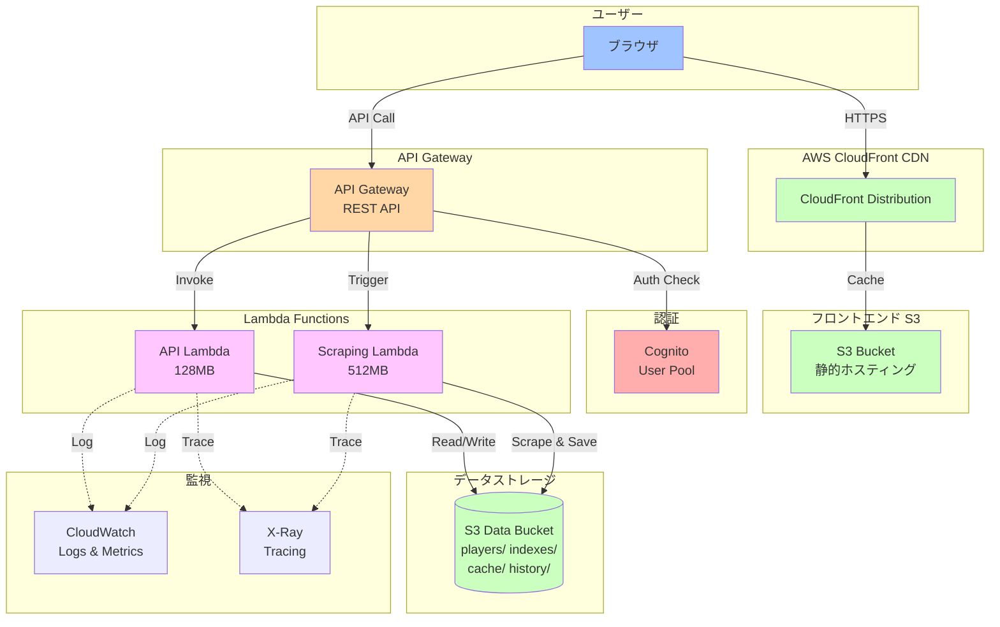
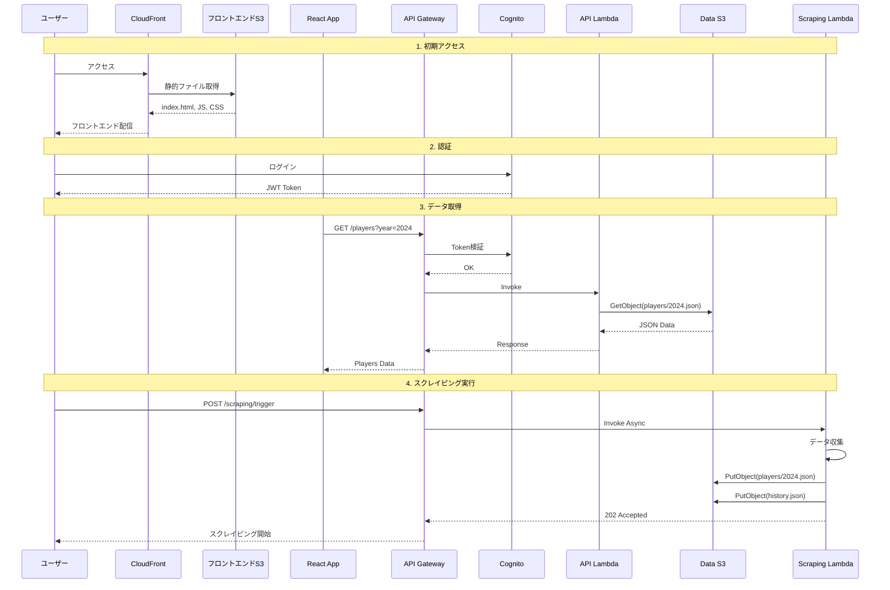
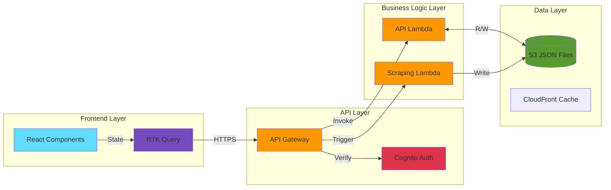

# システムアーキテクチャ

**最終更新**: 2026-08-23 - 公開範囲の方針転換（実名一覧を admin 限定化）を反映

## 🏗️ 概要

プロ野球志望届管理システム - **AWS サーバーレス + React**によるモジュラー設計。月額$0.50以下の低コスト運用を実現。

### 📚 ドキュメント3層アーキテクチャ（2025-06-29実装）

**Level 1 - 即座実行** (5分以内):

- [QUICK_START.md](QUICK_START.md): 3コマンドシステム起動
- [WORKFLOWS.md](WORKFLOWS.md): タスク別実行ガイド
- [EMERGENCY.md](EMERGENCY.md): 緊急時対応

**Level 2 - 実用開発** (30分以内):

- [ARCHITECTURE.md](ARCHITECTURE.md): システム設計詳細
- [development/DEPLOYMENT.md](development/DEPLOYMENT.md): デプロイガイド
- [development/TESTING/E2E_TESTING.md](development/TESTING/E2E_TESTING.md): テスト実行

**Level 3 - 専門知識** (深い理解):

- [development/baseball-features/](development/baseball-features/): 野球業務特化
- [operation/TROUBLESHOOTING.md](operation/TROUBLESHOOTING.md): 高度トラブル対応
- アーカイブ・詳細設定資料

## 🔧 技術スタック

### フロントエンド

- **React 19 + TypeScript 6.x**: メインUI
- **Material-UI (MUI 7.x)**: コンポーネント・ダークモード
- **RTK Query**: 唯一のAPI通信レイヤー（axios/react-query は廃止済み）
- **CloudFront**: CDN配信

### バックエンド

- **Lambda**: Node.js 22.x・API処理・スクレイピング
- **API Gateway**: RESTful API・環境別CORS・Cognito認証
- **S3 + JSON**: データストレージ（DynamoDBの代替としてコスト最適化）
- **Cognito**: 認証システム（dev/prod両環境で有効）

### データフロー

#### システムアーキテクチャ全体図



#### データフロー詳細図



#### コンポーネント間の関係



## 📁 プロジェクト構造

### コア層 (`src/core/`)

- `types.ts`: TypeScript型定義・PlayerData・S3構造
- `utils.ts`: 構造化ログ・LogLevel列挙型
- `logger.ts`: ロガー

### フィーチャー層 (`src/features/`)

- **スクレイピング** (`scraping/`): データ収集・バッチ最適化
- **バリデーション** (`validation/`): 入力検証・セキュリティ
- **履歴管理** (`history/`): S3ベース履歴・差分計算

### 共通層 (`shared/`)

- `prefectures.ts`: 都道府県の正規化ロジック（フロント・バックエンド共通。ここに一本化する）

### スクレイピングLambda (`pro-candidate-aws/lambda/`)

- `scraping.ts`: ルーティング（handler）のみ
- `scraping/parsers.ts`: HTML解析・データ抽出
- `scraping/html-fetcher.ts`: HTTP取得
- `scraping/scraping-executor.ts`: 実行制御
- `scraping/s3-operations.ts`: S3読み書き・履歴管理

### インフラ (`pro-candidate-aws/`)

- **CDK**: Infrastructure as Code・TypeScript
- **Constructs**: S3・Lambda・API Gateway・CloudFront
- **Custom Resource**: SPA 404問題解決・自動設定

## 🗄️ データ構造

### S3バケット構成

```
pro-candidate-data-{env}/
├── players/
│   ├── highschool/2024.json    # 高校生データ
│   └── university/2024.json    # 大学生データ
├── indexes/
│   └── available-years.json    # 年度インデックス
├── cache/
│   └── statistics.json         # 統計キャッシュ
└── history/
    └── scraping-history.json   # 実行履歴
```

### PlayerData型

```typescript
interface PlayerData {
  name: string;
  school: string;
  position: string;
  prefecture: string;
  year: number;
  isDraftEligible: boolean;
}
```

## 🔒 セキュリティ

### 認証・認可

- **AWS Cognito**: 環境別UserPool（dev/prod両方で有効）
- **admin グループ必須**: 実名を含むAPIは Cognito 認証に加え、IDトークンの `cognito:groups` に `admin` が必要。API Gateway の authorizer と Lambda 側の検証で二重に防御する
- **セルフサインアップ無効**: `selfSignUpEnabled: false`。アカウントは運営者が招待・作成する
- **admin グループの用意**: CDK 管理外。`scripts/ensure-cognito-admin.sh` が冪等に作成する（手順は [aws/COGNITO_ADMIN_SETUP.md](aws/COGNITO_ADMIN_SETUP.md)）
- **CORS**: prod環境はCloudFrontドメインのみ許可、dev環境は全オリジン許可
- **セッション**: 永続化・自動リトライ・リアルタイム監視

### 公開範囲（2026-08-23 方針転換）

実名一覧は一般公開しない。認証なしで到達できるのは、個人を識別できない集計だけ。

- **認証不要（公開）**: `GET /health` / `GET /statistics`（氏名・学校名を含まない集計のみ）/ `GET /schools` / `GET /years/available`
- **admin 限定**: `/players` 系すべて・`/schools/{school}/players`・`/scraping/*`・`ANY /{proxy+}`
- **画面**: 未ログインで見られるのはトップの集計ダッシュボードのみ。`/highschool-players`・`/university-players` は `/auth/login` へ誘導される
- **robots.txt**: 全ページ Disallow を維持
- **CSV**: 公開ページからの一括出力は廃止済み。CSV は認証必須の管理画面のみ
- ※ この方針は dev（develop ブランチ）に反映済み。**prod は未反映**で、旧状態（実名一覧が無認証で見える）のまま。実名公開の再開は法務専門家の確認後に再判断する

### データ保護

- **S3暗号化**: AES-256・サーバーサイド暗号化
- **IAM最小権限**: 特定パス制限・機能別権限分離
- **入力検証**: XSS・SQLインジェクション防止

## 📊 運用・監視

### パフォーマンス

- **Lambda**: 512MB（スクレイピング）・128MB（API）
- **S3キャッシュ**: TTL 5-15分・データ種別最適化
- **API**: 50-80%呼び出し削減達成

### 監視・ログ

- **CloudWatch**: メトリクス・ログ・アラーム（5個上限）
- **X-Ray**: 分散トレーシング・パフォーマンス分析
- **コスト**: 月額$0.50閾値アラーム・自動最適化

### 高可用性

- **Auto Scaling**: Lambda並行実行・API Gateway自動スケール
- **Backup**: S3バージョニング・ライフサイクル管理
- **災害復旧**: CloudFormation・Infrastructure as Code

## 🤖 AI統合

### Claude Code + Gemini

- **直接API**: Gemini Flash・リアルタイム応答
- **MCP統合**: Claude Desktop対応・10専用ツール
- **開発支援**: コードレビュー・デバッグ・技術説明

## 🚀 デプロイ・CI/CD

### 自動化

- **GitHub Actions**: 分離型パイプライン・並列実行
- **フロントエンド**: 3-5分（75%短縮）
- **インフラ**: 8-12分・CDK差分デプロイ

### 環境管理

- **dev**: 自動デプロイ（develop push）
- **prod**: タグベースリリース・手動承認
- **検証**: 自動テスト・環境確認・ヘルスチェック

## 📋 API仕様・使用例

### 主要エンドポイント

| エンドポイント                  | 説明                         | パラメータ              | 認証           |
| ------------------------------- | ---------------------------- | ----------------------- | -------------- |
| `GET /health`                   | ヘルスチェック               | -                       | 不要           |
| `GET /statistics`               | 集計（氏名・学校名なし）     | `type`, `year`          | 不要           |
| `GET /schools`                  | 学校一覧                     | -                       | 不要           |
| `GET /years/available`          | 利用可能年度一覧             | -                       | 不要           |
| `GET /players`                  | 選手データ取得（ページング） | `type`, `year`, `limit` | admin グループ |
| `GET /players/{id}`             | 選手詳細                     | -                       | admin グループ |
| `GET /players/search`           | 氏名検索                     | `name`                  | admin グループ |
| `GET /schools/{school}/players` | 学校別選手一覧               | -                       | admin グループ |
| `POST /scraping/trigger`        | スクレイピング実行           | `type`, `year`          | admin グループ |
| `GET /scraping/history`         | 実行履歴                     | `limit`                 | admin グループ |

`GET /players` はページング必須（既定100件・上限500件）。「admin グループ」は Cognito 認証済み、かつ IDトークンの `cognito:groups` に `admin` があることを指す。

### 使用例

```bash
# 集計取得（認証不要）
curl "https://api.example.com/statistics?year=2024"

# 高校生データ取得（admin グループのIDトークンが必要）
curl "https://api.example.com/players?type=highschool&year=2024&limit=100" \
  -H "Authorization: Bearer $ID_TOKEN"

# スクレイピング実行
curl -X POST "https://api.example.com/scraping/trigger" \
  -H "Authorization: Bearer $ID_TOKEN" \
  -H "Content-Type: application/json" \
  -d '{"type": "both", "year": 2024}'

# 実行履歴確認
curl "https://api.example.com/scraping/history?limit=10" \
  -H "Authorization: Bearer $ID_TOKEN"
```

### エラーハンドリング

| コード | 説明                 | 対応                                                                 |
| ------ | -------------------- | -------------------------------------------------------------------- |
| 400    | バリデーションエラー | パラメータ確認                                                       |
| 401    | 認証失敗             | トークン再取得                                                       |
| 403    | admin グループ未所属 | グループ追加（[COGNITO_ADMIN_SETUP.md](aws/COGNITO_ADMIN_SETUP.md)） |
| 404    | リソース不存在       | URL確認                                                              |
| 500    | サーバーエラー       | ログ確認                                                             |

### 認証

**環境別認証**:

- **ローカル**: フロントエンドは認証スキップ（開発効率）
- **dev/prod**: 両環境とも AWS Cognito 必須（RTK Query baseQuery で自動トークン送信）。実名系・管理系はさらに admin グループが必要

E2Eテストは実ログイン・実トークン方式（`tests/e2e/helpers/api-auth.ts` の `getAuthHeaders()`、認証情報は Doppler の `e2e_dev` / `e2e_prod`）。ダミートークンによるモック認証は使わない。

```javascript
// Cognito認証例
import { Auth } from 'aws-amplify';

const token = await Auth.currentSession();
const headers = {
  Authorization: `Bearer ${token.getIdToken().getJwtToken()}`,
};
```

## 🔍 パフォーマンス最適化

### キャッシュ戦略

- **RTK Query**: クライアントサイドキャッシュ
- **API Gateway**: レスポンスキャッシュ300秒
- **CloudFront**: 静的アセット31536000秒

### メモリ最適化

- **Lambdaスクレイピング**: 512MB（パフォーマンス重視）
- **Lambda API**: 128MB（コスト重視）
- **フロントエンド**: メモリ300MB基準

### コスト最適化

- **S3ライフサイクル**: IA→4月→Glacier→1年
- **CloudWatch**: ログ保持期間4週間
- **無料枠監視**: 月額$0.50閾値アラーム

詳細は[DEPLOYMENT.md](development/DEPLOYMENT.md)参照
