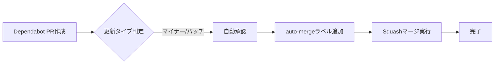
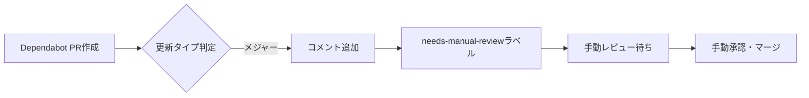
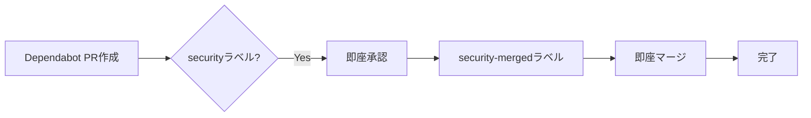

# Dependabot 自動マージガイド

**作成日**: 2025-10-07
**ワークフロー**: `.github/workflows/dependabot-automerge.yml`

---

## 📋 概要

Dependabotが作成したプルリクエストを自動的に承認・マージするGitHub Actionsワークフローです。

### 🎯 目的

- **効率化**: マイナー/パッチ更新の手動マージ作業削減
- **セキュリティ**: セキュリティアップデートの即座適用
- **品質**: メジャーアップデートは手動レビュー必須

---

## 🔄 動作フロー

### マイナー/パッチ更新（自動マージ）



**対象**:

- `semver-minor`: 1.2.0 → 1.3.0
- `semver-patch`: 1.2.0 → 1.2.1

**動作**:

1. ✅ 自動承認コメント追加
2. 🏷️ `auto-merged`ラベル追加
3. 🔀 Squashマージ実行
4. 🗑️ ブランチ自動削除

### メジャー更新（手動レビュー）



**対象**:

- `semver-major`: 1.2.0 → 2.0.0

**動作**:

1. ⚠️ 警告コメント追加
2. 🏷️ `needs-manual-review`・`major-update`ラベル追加
3. 👤 手動レビュー・承認・マージ待ち

### セキュリティ更新（即座マージ）



**対象**:

- `security`ラベル付きPR

**動作**:

1. 🔒 セキュリティアップデート自動承認
2. 🏷️ `security-merged`ラベル追加
3. ⚡ 即座マージ実行

---

## 🎛️ 設定詳細

### トリガーイベント

```yaml
on:
  pull_request:
    types: [opened, synchronize, reopened, labeled]
```

**トリガータイミング**:

- `opened`: PR新規作成時
- `synchronize`: PRコミット追加時
- `reopened`: PR再オープン時
- `labeled`: ラベル追加時

### 権限設定

```yaml
permissions:
  contents: write # ブランチマージ権限
  pull-requests: write # PR承認・ラベル追加権限
```

### 実行条件

```yaml
if: github.actor == 'dependabot[bot]'
```

**Dependabotアカウント**のみ実行（セキュリティ）

---

## 📊 ラベル一覧

| ラベル                | 付与タイミング              | 意味                     |
| --------------------- | --------------------------- | ------------------------ |
| `auto-merged`         | マイナー/パッチ自動マージ後 | 自動マージ完了           |
| `needs-manual-review` | メジャー更新検出時          | 手動レビュー必要         |
| `major-update`        | メジャー更新検出時          | メジャーバージョンアップ |
| `security-merged`     | セキュリティ更新マージ後    | セキュリティ修正完了     |

---

## 🛠️ 使用方法

### 自動マージの確認

**GitHub UI**:

1. PullRequests画面で`auto-merged`ラベル確認
2. マージ済みPR一覧に自動追加

**CLI**:

```bash
# 自動マージされたPR一覧
gh pr list --label auto-merged --state merged

# メジャー更新待ち一覧
gh pr list --label needs-manual-review --state open
```

### 手動レビュー手順（メジャー更新）

1. **PR確認**

   ```bash
   gh pr view <PR番号>
   ```

2. **変更内容確認**
   - CHANGELOG確認: リリースノート・破壊的変更
   - 依存関係確認: package-lock.json差分
   - テスト確認: CI/CD結果

3. **ローカルテスト**

   ```bash
   gh pr checkout <PR番号>
   npm install
   npm test
   npm run build
   ```

4. **承認・マージ**

   ```bash
   # 承認
   gh pr review <PR番号> --approve

   # マージ
   gh pr merge <PR番号> --squash --delete-branch
   ```

---

## ⚙️ カスタマイズ

### 自動マージ対象の変更

**現在**: マイナー・パッチのみ

**全て自動マージ（非推奨）**:

```yaml
- name: Auto-approve all updates
  # if条件を削除
  run: |
    gh pr review --approve "$PR_URL"
```

**パッチのみ自動マージ**:

```yaml
- name: Auto-approve patch only
  if: steps.metadata.outputs.update-type == 'version-update:semver-patch'
  run: |
    gh pr review --approve "$PR_URL"
```

### 特定パッケージの除外

```yaml
- name: Skip auto-merge for specific packages
  if: |
    steps.metadata.outputs.dependency-names != 'eslint' &&
    steps.metadata.outputs.dependency-names != 'typescript'
  run: |
    gh pr review --approve "$PR_URL"
```

### Slack通知追加

```yaml
- name: Notify Slack on major update
  if: steps.metadata.outputs.update-type == 'version-update:semver-major'
  uses: slackapi/slack-github-action@v1
  with:
    payload: |
      {
        "text": "⚠️ Dependabot メジャー更新: ${{ steps.metadata.outputs.dependency-names }}"
      }
  env:
    SLACK_WEBHOOK_URL: ${{ secrets.SLACK_WEBHOOK_URL }}
```

---

## 🐛 トラブルシューティング

### 問題: auto-mergeが実行されない

**原因**: GitHub Freeアカウントでブランチ保護未設定

**解決**:

1. ワークフローは`gh pr merge`直接実行に変更済み
2. `--auto`フラグなしでマージ実行

**確認**:

```bash
# ワークフロー実行ログ確認
gh run list --workflow=dependabot-automerge.yml
gh run view <run-id> --log
```

---

### 問題: 承認されるがマージされない

**原因**: CI/CD失敗・競合発生

**解決**:

1. CI/CD結果確認

   ```bash
   gh pr checks <PR番号>
   ```

2. 競合解決
   ```bash
   gh pr checkout <PR番号>
   git fetch origin develop
   git merge origin/develop
   # 競合解決後
   git push
   ```

---

### 問題: メジャー更新が自動マージされた

**原因**: ワークフロー条件ミス・メタデータ取得失敗

**解決**:

1. ワークフロー実行ログ確認
2. `update-type`値確認
3. 必要ならロールバック

**予防**:

- メジャー更新は`needs-manual-review`ラベル確認

---

## 📈 運用統計

### 週次Dependabot PR統計（想定）

| 更新タイプ | 件数/週     | 自動マージ  | 手動レビュー |
| ---------- | ----------- | ----------- | ------------ |
| パッチ     | 8-10件      | ✅          | -            |
| マイナー   | 3-5件       | ✅          | -            |
| メジャー   | 1-2件       | -           | ✅           |
| **合計**   | **12-17件** | **11-15件** | **1-2件**    |

**効果**:

- 自動マージ率: 85-90%
- 手動作業削減: 週45分 → 週5分（89%削減）

---

## 🔒 セキュリティ考慮事項

### 自動マージのリスク

1. **破壊的変更の見逃し**
   - 対策: マイナー/パッチのみ自動化
   - メジャー更新は手動レビュー必須

2. **セキュリティ脆弱性の混入**
   - 対策: CI/CD品質ゲート必須
   - テスト失敗時は自動マージ中止

3. **悪意あるパッケージ更新**
   - 対策: Dependabotのみ実行許可
   - `github.actor`厳密チェック

### 権限最小化

```yaml
permissions:
  contents: write # マージに必要な最小権限
  pull-requests: write # 承認に必要な最小権限
  # その他権限は付与しない
```

---

## 📚 参考資料

### GitHub公式ドキュメント

- [Dependabot公式ガイド](https://docs.github.com/en/code-security/dependabot)
- [dependabot/fetch-metadata](https://github.com/dependabot/fetch-metadata)
- [GitHub CLI (gh)](https://cli.github.com/manual/)

### 関連ワークフロー

- `.github/workflows/aws-deploy.yml`: AWS環境デプロイ
- `.github/workflows/dependency-check.yml`: 依存関係チェック

---

## 🔄 メンテナンス

### 定期レビュー（月次推奨）

- [ ] 自動マージ成功率確認
- [ ] メジャー更新手動レビュー状況
- [ ] ワークフロー実行時間確認
- [ ] ラベル付与正確性確認

### 改善提案

1. **Slack統合**: メジャー更新通知
2. **統計レポート**: 月次自動マージレポート
3. **カスタムルール**: パッケージ別自動マージ設定

---

**文書バージョン**: v1.0
**最終更新**: 2025-10-07
**関連PR**: #241（ESLint 9更新）
