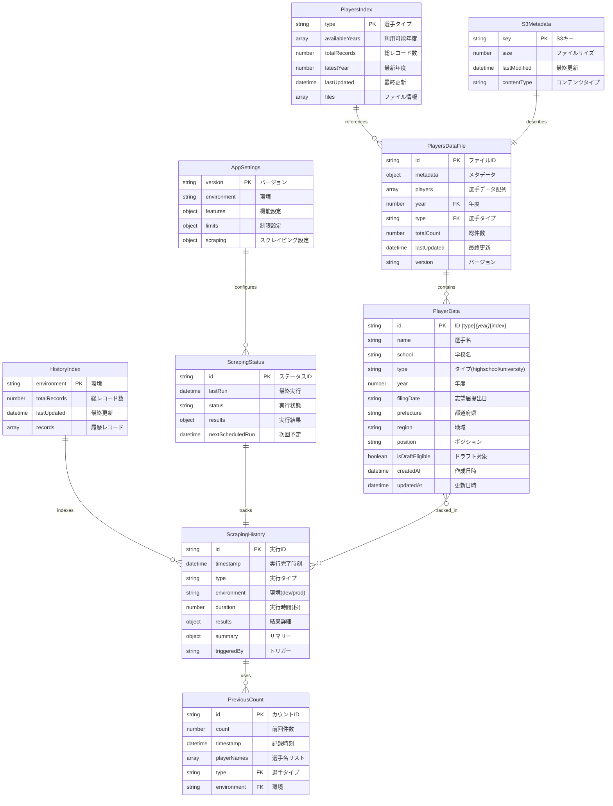

# プロ野球志望届システム ER図

## システム概要

高校生・大学生のプロ野球志望届データを収集・管理するAWSクラウドネイティブシステムのデータ構造図

## ER図（Entity-Relationship Diagram）



## エンティティ詳細説明

### 主要エンティティ

#### 1. PlayerData（選手データ）

- **主キー**: id（一意識別子）
- **機能**: 個々の選手情報を管理
- **特徴**: 高校生・大学生両方に対応、ドラフト対象者フラグ付き

#### 2. PlayersDataFile（選手データファイル）

- **機能**: S3に保存される年度別・タイプ別のデータファイル
- **構造**: メタデータ + 選手データ配列
- **関係**: 複数のPlayerDataを含む

#### 3. PlayersIndex（選手インデックス）

- **機能**: 利用可能なデータファイルのインデックス管理
- **用途**: 年度選択UI、データ検索最適化

### 履歴管理エンティティ

#### 4. ScrapingHistory（スクレイピング履歴）

- **機能**: 実行履歴の詳細記録・差分計算
- **環境分離**: dev/prod環境別管理

#### 5. PreviousCount（前回件数データ）

- **機能**: 差分計算用データ・前回実行比較

### システム管理エンティティ

#### 6. S3Metadata（S3メタデータ）

- **機能**: S3オブジェクト情報管理
- **用途**: ファイルサイズ・更新日時追跡

#### 7. AppSettings（アプリケーション設定）

- **機能**: システム設定管理
- **範囲**: 機能フラグ・制限値・スクレイピング設定

## データフロー概要

### 1. データ収集フロー

```
スクレイピング実行 → PlayerData生成 → PlayersDataFile作成 → S3保存 → PlayersIndex更新
```

### 2. 履歴記録フロー

```
スクレイピング完了 → PreviousCountData参照 → 差分計算 → ScrapingHistoryRecord作成 → ScrapingHistoryIndex更新
```

### 3. データ検索フロー

```
PlayersIndex参照 → 対象ファイル特定 → PlayersDataFile読み込み → PlayerData抽出
```

## 技術特徴

- **S3ベースアーキテクチャ**: NoSQLからJSONファイルベースへ移行
- **環境分離**: dev/prod環境の完全分離
- **履歴追跡**: 詳細な変更履歴と差分計算
- **型安全性**: TypeScriptによる完全な型定義
- **AWS統合**: Lambda、S3、API Gatewayとの統合

## データ整合性

- PlayerDataのidは`{type}_{year}_{index}`形式で一意性保証
- 環境別（dev/prod）データ分離によるテスト安全性確保
- メタデータによるファイル整合性チェック
- インデックスファイルによる高速検索対応

---

_このER図はプロ野球志望届システム v1.2.84+ のデータ構造を表現_
